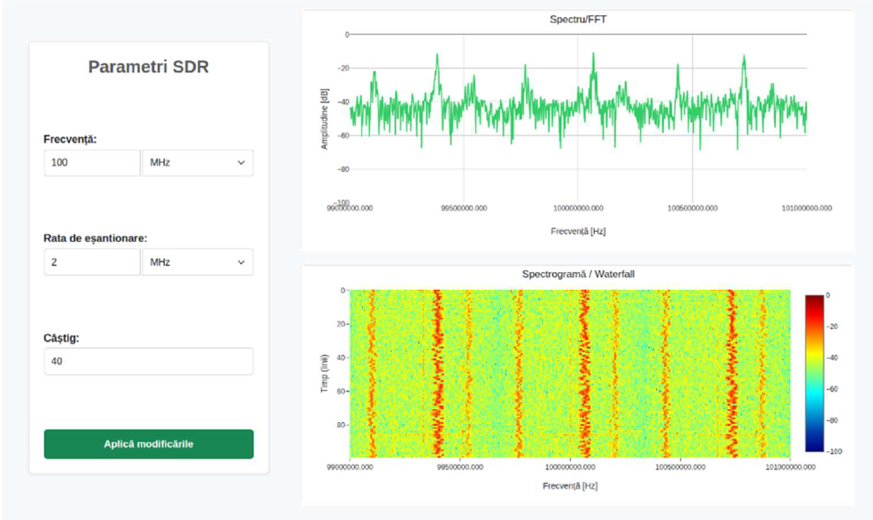
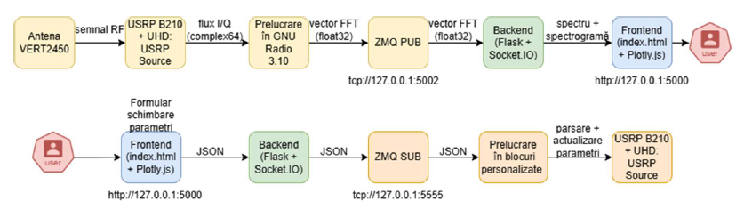
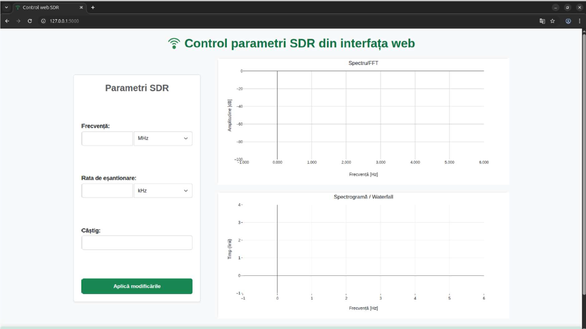
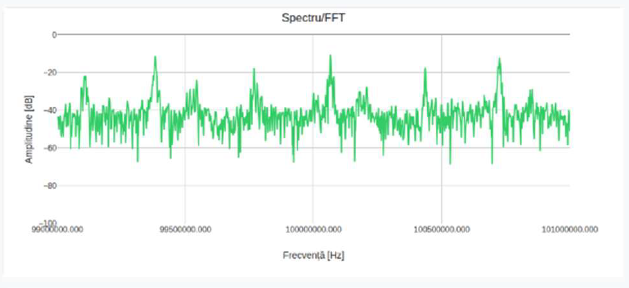
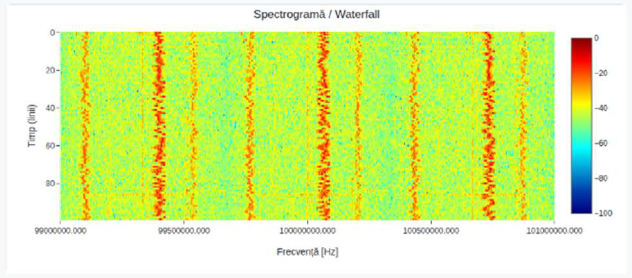

# Remote-Controlled SDR Communication System



This project was developed as part of my Bachelor's Thesis at the Military Technical Academy "Ferdinand I".

The goal of this project was to develop a web application for remotely controlling a Software Defined Radio (SDR) receiver. Using a browser, the user can change the receiver parameters while monitoring the received signal in real time through an FFT spectrum and waterfall display.

The project combines SDR technologies with web development and real-time communication to create an easy-to-use interface for interacting with a USRP B210 receiver.

---

## Project Overview

The application receives RF signals using a USRP B210 device and processes them in GNU Radio. The processed data is sent to a Flask backend through ZeroMQ and then forwarded to the browser using Socket.IO.

From the web interface, the user can:

- change the center frequency;
- adjust the receiver gain;
- modify the sample rate;
- monitor the FFT spectrum in real time;
- view the waterfall (spectrogram);
- interact with the receiver without accessing GNU Radio directly.

The communication works in both directions: GNU Radio continuously sends FFT data to the web interface, while any parameter changes made in the browser are immediately applied to the receiver.

---

## Technologies

This project was implemented using:

- Python
- GNU Radio 3.10
- UHD
- Flask
- Flask-SocketIO
- ZeroMQ
- Plotly.js
- HTML
- CSS
- JavaScript

Hardware used:

- USRP B210
- VERT2450 antenna

---

## System Architecture



The application consists of three main components.

The first one is the GNU Radio flowgraph, which communicates with the USRP B210 and processes the received signal.

The second component is the Flask backend, which acts as a bridge between GNU Radio and the web application. It receives FFT data through ZeroMQ and sends it to the browser using Socket.IO.

The third component is the frontend, where the user can visualize the received spectrum and remotely configure the SDR receiver.

---

## Screenshots

### Web Interface



The main page of the application where the receiver parameters can be configured.

### FFT Spectrum



Real-time spectrum visualization generated in GNU Radio and displayed with Plotly.js.

### Waterfall



Time-frequency representation of the received signal.

---

## Project Structure

```text
remote-sdr-system/
│
├── backend.py
├── sdr_receiver.py
├── sdr_receiver_epy_block_0.py
├── sdr_receiver_epy_block_1.py
├── sdr_tx.py
│
├── templates/
│   └── index.html
│
├── static/
│   ├── css/
│   ├── js/
│   └── images/
│
├── docs/
│   └── images/
│
└── README.md
```

---

## Running the project

Clone the repository:

```bash
git clone https://github.com/ancahergheligiu/remote-sdr-system.git
```

Install the required Python packages:

```bash
pip install flask flask-socketio pyzmq numpy
```

GNU Radio and UHD must also be installed.

After connecting the USRP B210, start the GNU Radio receiver and then run:

```bash
python backend.py
```

Finally, open your browser and go to:

```
http://127.0.0.1:5000
```

---

## What I learned

Throughout its development, I gained practical experience with GNU Radio, Flask, ZeroMQ, Socket.IO and Plotly.js, while also learning how to design and implement a complete application that combines signal processing, backend development and a web-based user interface.

---

## Future improvements

If I continue developing this project, I would like to add:

- support for multiple SDR devices;
- user authentication;
- signal recording and playback;
- remote transmitter control;
- Docker support;
- HTTPS communication.

---

## Author

**Anca Hergheligiu**

Bachelor's Degree in Communications for Defence and Security

Military Technical Academy "Ferdinand I"
